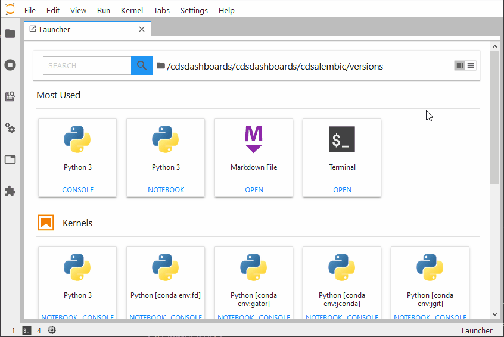

# @jlab-enhanced/launcher

[](https://mybinder.org/v2/gh/fcollonval/jlab-enhanced-launcher/master?urlpath=lab)

A enhanced launcher for JupyterLab.



This codes started from https://github.com/jupyterlab/jupyterlab/pull/5953.

## Requirements

* JupyterLab >= 2.0

## Install

```bash
jupyter labextension install @jlab-enhanced/launcher
jupyter labextension disable @jupyterlab/launcher-extension
```

## Uninstall

```bash
jupyter labextension uninstall @jlab-enhanced/launcher
jupyter labextension enable @jupyterlab/launcher-extension
```

## Contributing

### Development Install

The `jlpm` command is JupyterLab's pinned version of
[yarn](https://yarnpkg.com/) that is installed with JupyterLab. You may use
`yarn` or `npm` in lieu of `jlpm` below.

```bash
# Clone the repo to your local environment
# Move to launcher directory

# Install dependencies
jlpm
# Build Typescript source
jlpm build
# Link your development version of the extension with JupyterLab
jupyter labextension install .
jupyter labextension disable @jupyterlab/launcher-extension
# Rebuild Typescript source after making changes
jlpm build
# Rebuild JupyterLab after making any changes
jupyter lab build
```

You can watch the source directory and run JupyterLab in watch mode to watch for changes in the extension's source and automatically rebuild the extension and application.

```bash
# Watch the source directory in another terminal tab
jlpm watch
# Run jupyterlab in watch mode in one terminal tab
jupyter lab --watch
```

Now every change will be built locally and bundled into JupyterLab. Be sure to refresh your browser page after saving file changes to reload the extension (note: you'll need to wait for webpack to finish, which can take 10s+ at times).
